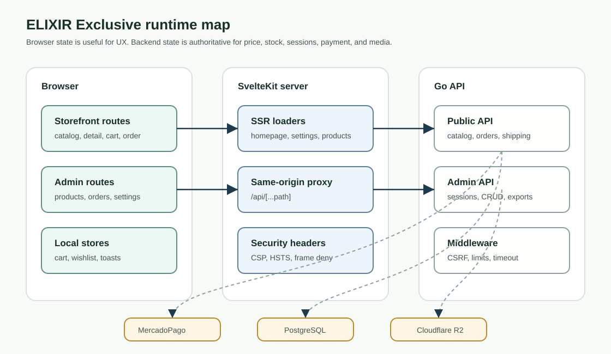

# ELIXIR Exclusive

Perfume commerce platform with a SvelteKit storefront, a Go API, PostgreSQL persistence, MercadoPago checkout, admin operations, and Cloudflare R2-backed image uploads.


<p align="center">
  
</p>



## What It Does

ELIXIR Exclusive is a full-stack ecommerce codebase for a curated perfume store in Argentina. The frontend serves public catalog, product detail, wishlist, cart, checkout, contact, FAQ, shipping, order-status, and admin pages. The backend owns catalog data, cart validation, orders, payment events, shipping quotes, contact messages, media uploads, and admin session security.

The repository is structured as a deployable monorepo:

- `frontend/` is a SvelteKit 2 application with an adapter-node build target and a same-origin API proxy.
- `backend/` is a Go 1.24 HTTP API using Chi, pgx, PostgreSQL migrations, MercadoPago integration, and S3-compatible Cloudflare R2 storage.

## Core Capabilities

| Capability | Implementation | Operational note |
| --- | --- | --- |
| Public storefront | `frontend/src/routes`, `frontend/src/lib/components`, `frontend/src/lib/api/client.ts` | Product pages and homepage data are fetched through `/api/*`; fallback copy exists for homepage, settings, and shipping zones. |
| Product catalog | `backend/internal/products`, `backend/migrations/002_catalog.sql` | Supports active products, featured products, variants, primary images, notes, families, gender tags, concentrations, and price sorting. |
| Cart and orders | `frontend/src/routes/carrito`, `backend/internal/orders` | Backend revalidates variant IDs, prices, stock, discounts, shipping, and totals before creating an order. |
| Payments | `backend/internal/payments` | MercadoPago preferences are created from stored orders; webhooks require the MercadoPago signature secret and timestamp tolerance. |
| Admin operations | `frontend/src/routes/admin`, `backend/internal/admin` | Cookie sessions protect products, orders, discounts, homepage settings, site settings, shipping zones, messages, and admin users. |
| Media uploads | `backend/internal/media`, `backend/internal/admin/upload.go` | Admin uploads accept JPEG, PNG, or WebP up to 10 MB, transcode to WebP, and store in R2 when all R2 variables are configured. |
| Shipping | `backend/internal/shipping`, `backend/migrations/004_operations.sql` | Local pickup, configured shipping zones, Correo Argentino, and Andreani providers are wired behind quote endpoints. |
| Runtime protection | `backend/internal/middleware`, `frontend/src/hooks.server.ts` | Security headers, CSRF origin checks, request timeouts, compression, rate limits, no-store admin responses, and CSP are implemented. |

## Architecture

The frontend can call the backend directly with `PUBLIC_API_URL`, but browser requests normally use the SvelteKit same-origin proxy at `frontend/src/routes/api/[...path]/+server.ts`. That proxy forwards client IP headers, strips hop-by-hop headers, and returns controlled service-unavailable errors for upstream failures.

The backend is the trust boundary for prices, stock, order totals, admin sessions, image uploads, and payment state. The browser can hold cart and wishlist state, but it does not decide final prices or stock availability.

## Repository Layout

```text
.
|-- backend/
|   |-- cmd/api/             # HTTP server bootstrap and route wiring
|   |-- cmd/migrate/         # PostgreSQL migration runner
|   |-- cmd/seed/            # Seed products, settings, zones, discounts, and admin user
|   |-- internal/            # Domain packages and middleware
|   |-- migrations/          # Ordered SQL schema migrations
|   |-- .env.example         # Backend configuration contract
|   `-- README.md            # Backend operator and API guide
|-- frontend/
|   |-- src/routes/          # SvelteKit pages, admin pages, proxy, sitemap, robots
|   |-- src/lib/             # API client, stores, components, utilities, types
|   |-- static/              # Logo, favicon, PWA manifest, icon
|   |-- .env.example         # Frontend configuration contract
|   |-- package.json         # Vite, SvelteKit, check, build scripts
|   `-- README.md            # Frontend maintainer guide
`-- docs/assets/             # Root README diagrams
```

## Prerequisites

- Go `1.24.0`, from `backend/go.mod`.
- Node.js and npm capable of installing the checked-in `frontend/package-lock.json`.
- PostgreSQL with `pgcrypto`, used by the first migration for UUID generation.
- MercadoPago credentials for real checkout and payment webhooks.
- Cloudflare R2 credentials only when admin image uploads must work.
- Optional carrier credentials for Correo Argentino and Andreani quotes.

## Configuration

Backend configuration is documented in `backend/.env.example`. Important variables include:

| Variable | Purpose |
| --- | --- |
| `APP_ENV`, `PORT`, `FRONTEND_URL`, `BACKEND_URL` | Runtime mode, listener port, browser origin, and backend public URL. |
| `DATABASE_URL` | PostgreSQL connection string. Required outside development and required by `cmd/migrate` and `cmd/seed`. |
| `SESSION_SECRET`, `SESSION_DURATION_HOURS`, `SESSION_SAME_SITE` | Admin cookie signing and lifetime controls. Production secrets must be random and at least 32 characters. |
| `MP_ACCESS_TOKEN`, `MP_WEBHOOK_SECRET` | MercadoPago preference creation and signed webhook validation. |
| `ALLOWED_ORIGINS` | Extra browser origins. `FRONTEND_URL` is always included. |
| `R2_ACCOUNT_ID`, `R2_ACCESS_KEY`, `R2_SECRET_KEY`, `R2_BUCKET_NAME`, `R2_PUBLIC_URL` | Required together for image upload storage. Partial R2 configuration fails startup. |

Frontend configuration is documented in `frontend/.env.example`:

| Variable | Purpose |
| --- | --- |
| `PRIVATE_API_URL` | Server-side SvelteKit proxy target, usually the backend internal or public URL. |
| `PUBLIC_API_URL` | Public backend URL for direct public API calls when not using same-origin proxy. |
| `PUBLIC_WHATSAPP_NUMBER` | Number used by cart, contact, and order-status WhatsApp links. |
| `PUBLIC_SITE_URL` | Canonical site origin for layout metadata, sitemap, and robots output. |

## Quick Start

Run the backend first:

```bash
cd backend
cp .env.example .env
# Edit .env and set DATABASE_URL before running migrations or seed data.
go run ./cmd/migrate
go run ./cmd/seed
go run ./cmd/api
```

The seed command creates an `admin` user with password `elixir2024`.

> [!WARNING]
> Change the seeded admin password immediately after the first login. The seed command is meant for local bootstrap and controlled environments.

Run the frontend in another terminal:

```bash
cd frontend
cp .env.example .env
npm install
npm run dev
```

The default local origins are:

| Service | URL |
| --- | --- |
| Frontend | `http://localhost:5173` |
| Backend | `http://localhost:8080` |
| Health check | `http://localhost:8080/api/health` |
| Admin login | `http://localhost:5173/admin/login` |

## Verification

Backend checks:

```bash
cd backend
go test ./...
go run ./cmd/api
```

Frontend checks:

```bash
cd frontend
npm run check
npm run build
npm run preview
```

Smoke checks after both services are running:

```bash
curl http://localhost:8080/api/health
curl http://localhost:8080/api/products
curl http://localhost:5173/api/products
```

## Operations And Security

- Admin cookies are signed by `SESSION_SECRET`; `APP_ENV` controls whether secure cookies are required.
- Admin API responses are marked `Cache-Control: no-store`.
- Non-GET backend requests pass CSRF origin and `Sec-Fetch-Site` checks against `FRONTEND_URL`, `BACKEND_URL`, and `ALLOWED_ORIGINS`.
- Login is limited to 5 failed attempts per IP in 10 minutes. General API writes are limited to 60 requests per minute per IP, and MercadoPago webhooks to 120 per minute.
- JSON write routes use a 2 MB body limit. Admin image upload uses a 10 MB request cap and validates filename extension, content type, decoded image format, and pixel count.
- MercadoPago webhooks are rejected when `MP_WEBHOOK_SECRET` is missing, the signature is malformed, the timestamp is outside tolerance, or the HMAC does not match.
- R2 storage is optional, but if any R2 setting is present then all R2 settings must be present.
- The backend logs JSON to stdout through `slog`.

## Deployment Notes

The backend README contains Render-oriented commands from the original project notes:

- Build command: `go build -o app ./cmd/api/main.go`
- Start command: `./app`
- Health check path: `/api/health`

The frontend uses SvelteKit adapter-node. `npm run build` creates the production build, and `npm run preview` serves the built app for validation. The repository does not currently define a dedicated production `start` script.

## Troubleshooting

| Symptom | Likely cause | Fix |
| --- | --- | --- |
| `DATABASE_URL is not configured` during migrate or seed | `.env` still has the placeholder or no database URL | Set `DATABASE_URL` in `backend/.env` before running `go run ./cmd/migrate`. |
| Admin login works locally but fails in production | Session secret or cookie settings are invalid for the environment | Set a random `SESSION_SECRET`, use the real `FRONTEND_URL`, and verify HTTPS proxy headers. |
| Frontend `/api/*` returns `Servicio temporalmente no disponible` | SvelteKit proxy cannot reach the backend | Check `PRIVATE_API_URL`, backend health, and hosting network rules. |
| Browser requests get `origen no permitido` | Backend CSRF origin list does not include the frontend origin | Set `FRONTEND_URL` exactly and use `ALLOWED_ORIGINS` for additional domains. |
| Admin image upload returns storage not configured | R2 variables are missing or partial | Set all five R2 variables, including a public base URL without a trailing slash. |
| MercadoPago webhook returns 401 | Missing or mismatched webhook secret/signature | Set `MP_WEBHOOK_SECRET` to the value configured in MercadoPago and forward the original signature headers. |

## Project READMEs

- [Backend guide](backend/README.md)
- [Frontend guide](frontend/README.md)
