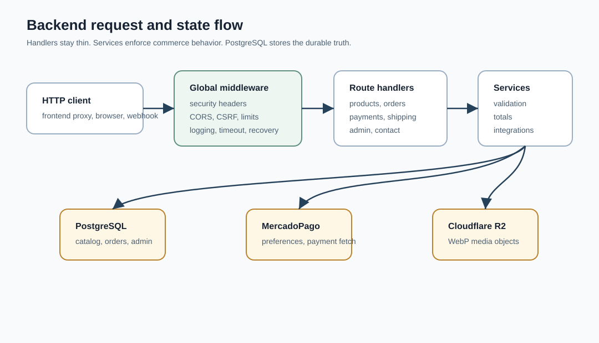

# ELIXIR Exclusive Backend

Go API for catalog, cart validation, orders, MercadoPago checkout, signed payment webhooks, admin sessions, shipping quotes, contact messages, and Cloudflare R2 image uploads.




## What It Does

The backend is the authoritative service layer for ELIXIR Exclusive. It validates catalog reads, cart contents, discount codes, order totals, payment updates, admin sessions, admin CRUD operations, image upload processing, shipping quote providers, contact messages, and operational metrics.

The server starts from `cmd/api/main.go`, loads `.env` and `backend/.env`, validates runtime configuration, connects to PostgreSQL, builds domain services, registers Chi routes, and shuts down gracefully on interrupt or `SIGTERM`.

## Core Capabilities

| Area | Package | Responsibility |
| --- | --- | --- |
| Configuration | `internal/config` | Loads environment variables, validates production safety requirements, merges `FRONTEND_URL` into CORS and CSRF origins. |
| Database | `internal/db`, `migrations` | Connects with pgx and applies ordered SQL migrations from the repository. |
| Catalog | `internal/products` | Lists products with filters, serves details by slug, and exposes public search. |
| Orders | `internal/orders` | Validates cart lines, recalculates totals, applies discounts, creates orders, and serves order status. |
| Payments | `internal/payments` | Creates MercadoPago preferences and processes signed webhook notifications idempotently. |
| Admin | `internal/admin` | Manages authentication, users, products, orders, discounts, homepage, site settings, shipping zones, contact messages, and low-stock reports. |
| Media | `internal/media` | Validates, decodes, transcodes, and uploads product/homepage images to Cloudflare R2. |
| Shipping | `internal/shipping` | Combines local pickup, zone-based pricing, Correo Argentino, and Andreani providers. |
| Middleware | `internal/middleware` | Applies request IDs, logging, compression, recovery, security headers, CORS, CSRF, timeouts, and rate limits. |

## API Surface

| Surface | Routes |
| --- | --- |
| Health | `GET /api/health` |
| Homepage and settings | `GET /api/homepage`, `GET /api/settings` |
| Products | `GET /api/products`, `GET /api/products/{slug}`, `GET /api/products/search` |
| Cart, discounts, orders | `POST /api/cart/validate`, `POST /api/discount/validate`, `POST /api/orders`, `GET /api/orders/{external_reference}` |
| Payments | `POST /api/checkout/mercadopago/preference`, `POST /api/payments/mercadopago/webhook` |
| Shipping | `GET /api/shipping/zones`, `POST /api/shipping/quote` |
| Contact | `POST /api/contact`, `POST /api/contact/abandoned-cart` |
| Admin auth | `POST /api/admin/login`, `POST /api/admin/logout`, `GET /api/admin/me`, `POST /api/admin/password` |
| Admin operations | `/api/admin/users`, `/api/admin/products`, `/api/admin/orders`, `/api/admin/discounts`, `/api/admin/homepage`, `/api/admin/settings`, `/api/admin/shipping/zones`, `/api/admin/contact`, `/api/admin/low-stock`, `/api/admin/upload` |

Admin operation routes require the signed admin session cookie. Uploads also require a complete R2 configuration.

## Execution Path

1. `config.Load()` reads `.env` and `backend/.env`, preserving existing environment variables.
2. `Config.Validate()` rejects invalid session duration, weak session secret, missing production database URL, and incomplete MercadoPago production webhook configuration.
3. `db.Connect()` opens the PostgreSQL pool.
4. Services are assembled with repositories, session manager, storage service, MercadoPago client, shipping providers, and rate limiters.
5. Global middleware wraps every route with security headers, compression, panic recovery, request timeout, request logging, and CORS.
6. Mutating routes pass through CSRF origin checks. Admin routes also pass no-store cache headers and session validation.
7. The HTTP server listens on `:$PORT` and performs a 10 second graceful shutdown.

## Database Schema

The migrations create and evolve these main tables:

| Domain | Tables |
| --- | --- |
| Admin and content | `admin_users`, `homepage_settings`, `site_settings`, `audit_log` |
| Catalog | `products`, `product_variants`, `product_images` |
| Commerce | `orders`, `order_items`, `payment_events`, `discount_codes` |
| Operations | `contact_messages`, `shipping_zones`, `abandoned_carts` |

Indexes cover common catalog, order, payment, discount, contact, shipping, and audit queries. `pgcrypto` is enabled for UUID generation.

## Configuration

Copy `backend/.env.example` to `backend/.env` for local work.

| Variable | Required | Details |
| --- | --- | --- |
| `APP_ENV` | No | Defaults to `development`. Non-development enables stronger validation and secure cookie behavior. |
| `PORT` | No | Defaults to `8080`. |
| `FRONTEND_URL` | Yes for deployed browser use | Always added to allowed CORS and CSRF origins. Defaults to `http://localhost:5173`. |
| `BACKEND_URL` | Yes for deployed callbacks | Used by MercadoPago preference URLs and CSRF origin allowlisting. |
| `DATABASE_URL` | Yes outside development | Required by `cmd/migrate`, `cmd/seed`, and production startup. |
| `SESSION_SECRET` | Yes | Must be at least 32 characters. Production cannot use the default or placeholder secret. |
| `SESSION_DURATION_HOURS` | Yes | Must parse to an integer greater than zero. |
| `SESSION_SAME_SITE` | No | Defaults to `strict`; resolved by the admin session manager. |
| `MP_ACCESS_TOKEN` | For checkout | Used when creating MercadoPago preferences. |
| `MP_WEBHOOK_SECRET` | For webhooks | Required when MercadoPago is configured outside development. |
| `ALLOWED_ORIGINS` | Optional | Comma-separated additional browser origins. |
| `SMTP_*` | Optional | Present in the example for future or external mail delivery needs. |
| `WHATSAPP_NUMBER` | Optional | Default business contact number. |
| `CORREO_ARG_*`, `ANDREANI_*`, `ORIGIN_POSTAL_CODE` | Optional | Carrier quote provider credentials and origin. |
| `R2_ACCOUNT_ID`, `R2_ACCESS_KEY`, `R2_SECRET_KEY`, `R2_BUCKET_NAME`, `R2_PUBLIC_URL` | Optional as a complete set | All five are required for admin image uploads. Partial configuration fails startup. |
| `LOG_LEVEL` | Optional | Defaults to `info`; current startup config installs a JSON `slog` handler. |

## Local Development

```bash
cp .env.example .env
# Edit .env and set DATABASE_URL before running migrations or seed data.
go run ./cmd/migrate
go run ./cmd/seed
go run ./cmd/api
```

The seed creates `admin` with password `elixir2024`.

> [!WARNING]
> Change the seeded admin password immediately after first login. Do not reuse the seeded password in shared, staging, or production environments.

Smoke checks:

```bash
curl http://localhost:8080/api/health
curl http://localhost:8080/api/products
curl http://localhost:8080/api/products/search?q=oud
```

## Test And Build

```bash
go test ./...
go build -o app ./cmd/api/main.go
```

The migration and seed commands intentionally fail when `DATABASE_URL` is missing or still contains the placeholder host.

## Operations And Security

- `SecurityHeaders` sets `X-Content-Type-Options`, `X-Frame-Options`, `Referrer-Policy`, `Permissions-Policy`, and HSTS when the request is TLS or forwarded as HTTPS.
- `CSRF` allows safe methods, then checks `Origin`, `Referer`, and `Sec-Fetch-Site` for mutating requests.
- Login failure throttling is 5 attempts per IP per 10 minutes.
- General write throttling is 60 requests per IP per minute; MercadoPago webhook throttling is 120 requests per IP per minute.
- Request timeout is 15 seconds; graceful shutdown timeout is 10 seconds.
- Public product list and detail responses set short public cache headers with stale-while-revalidate.
- Admin routes use `Cache-Control: no-store`.
- Uploads are capped at 10 MB, restricted to JPEG, PNG, or WebP, checked by decoded image metadata, and transcoded to WebP quality 80.
- MercadoPago webhooks validate `x-signature`, `x-request-id`, `data.id`, HMAC SHA-256, and a 15 minute timestamp tolerance.
- Payment processing checks for an existing payment event before fetching and recording the MercadoPago payment.

## Deployment Notes

Render-compatible settings from the project notes:

```text
Build command: go build -o app ./cmd/api/main.go
Start command: ./app
Health check path: /api/health
```

Set all required environment variables in the deployment dashboard. `FRONTEND_URL` must match the deployed frontend origin exactly. Use `ALLOWED_ORIGINS` only for extra browser origins. `R2_PUBLIC_URL` should be the public bucket or custom-domain base URL without a trailing slash.

WebP encoding uses CGO through `github.com/chai2010/webp`, so the build environment needs a C compiler.

## Troubleshooting

| Symptom | Cause | Fix |
| --- | --- | --- |
| `DATABASE_URL is not configured` | No database URL or placeholder URL | Set a real PostgreSQL URL before migrate, seed, or production startup. |
| Startup fails with `media: configuracion R2 incompleta` | Only some R2 variables are set | Set all five R2 variables or clear them all. |
| Admin upload returns `almacenamiento de imagenes no configurado` | R2 storage service is nil | Configure R2 and restart the API. |
| Mutating requests return `origen no permitido` | Browser origin is not allowlisted | Set `FRONTEND_URL` and any extra `ALLOWED_ORIGINS` without trailing slash mismatches. |
| MercadoPago webhook returns 401 | Signature header, timestamp, request ID, data ID, or secret does not match | Check `MP_WEBHOOK_SECRET` and preserve MercadoPago headers through the proxy. |
| Admin session is rejected after deploy | Cookie security or domain origin mismatch | Use HTTPS, set the real `FRONTEND_URL`, and use a production `SESSION_SECRET`. |
