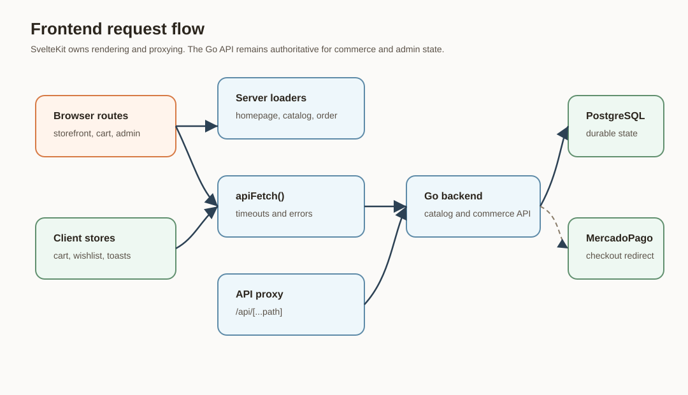

# ELIXIR Exclusive Frontend

SvelteKit storefront and admin console for ELIXIR Exclusive. It renders the public shopping experience, proxies API traffic to the Go backend, and provides the authenticated admin interface for catalog, orders, homepage, settings, shipping, discounts, users, and messages.


<p align="center">
  
</p>



## What It Does

The frontend is a SvelteKit 2 application using Svelte 5, TypeScript, Vite, and `@sveltejs/adapter-node`. It serves the customer-facing perfume store and the private admin console. The browser experience uses local stores for cart, wishlist, and toast state, while all authoritative commerce decisions are delegated to the backend API.

## Core Capabilities

| Capability | Location | Notes |
| --- | --- | --- |
| Homepage | `src/routes/+page.svelte`, `src/routes/+page.server.ts` | Fetches homepage settings, featured products, collection cards, and rotating product cover images. |
| Catalog | `src/routes/fragrances` | Supports filters, pagination, active count display, product grid, and server-loaded catalog data. |
| Product detail | `src/routes/fragrances/[slug]` | Loads a product by slug and related products by scent family. |
| Cart and checkout | `src/routes/carrito`, `src/lib/stores/cart.ts` | Validates cart, applies discount, quotes shipping, creates orders, and redirects to MercadoPago. |
| Wishlist | `src/routes/lista-de-deseos`, `src/lib/stores/wishlist.ts` | Stores product slugs locally and reloads details from the API. |
| Order status | `src/routes/orden/[ref]` | Loads order status and provides a WhatsApp contact link with the order reference. |
| Content pages | `src/routes/contacto`, `src/routes/envios`, `src/routes/preguntas-frecuentes`, `src/routes/politica-de-devolucion` | Use public settings and contact endpoints. |
| Admin console | `src/routes/admin`, `src/lib/components/admin` | Session-gated dashboard for products, orders, shipping, discounts, homepage content, site configuration, messages, users, and account password. |
| API boundary | `src/lib/api/client.ts`, `src/routes/api/[...path]/+server.ts` | Central fetch wrapper, timeout handling, same-origin proxy, admin 401 redirect, and controlled upstream errors. |
| SEO and crawlers | `src/routes/sitemap.xml`, `src/routes/robots.txt`, `src/lib/utils/seo.ts` | Uses `PUBLIC_SITE_URL` and backend product data to build crawler output. |

## Route Map

```text
src/routes/
|-- +layout.server.ts          # Loads site settings unless route is admin
|-- +page.server.ts            # Homepage data
|-- api/[...path]/+server.ts   # Same-origin backend proxy
|-- admin/                     # Authenticated administration
|-- carrito/                   # Cart, shipping quote, order creation, payment redirect
|-- contacto/                  # Contact form and WhatsApp link
|-- envios/                    # Shipping information from backend zones
|-- fragrances/                # Catalog and product detail
|-- lista-de-deseos/           # Wishlist
|-- orden/[ref]/               # Order status
|-- sitemap.xml/+server.ts     # Dynamic sitemap
`-- robots.txt/+server.ts      # Disallows admin routes
```

## Architecture

Browser code calls `apiFetch()` from `src/lib/api/client.ts`. In the browser, public `/api/*` calls use the same-origin SvelteKit proxy. Server-side loaders can use `PRIVATE_API_URL` through the proxy route, or `PUBLIC_API_URL` when configured for direct public API calls. Admin routes always use same-origin calls so session cookies are attached consistently.

The proxy strips hop-by-hop headers, forwards `X-Forwarded-Proto`, `X-Forwarded-Host`, `X-Forwarded-For`, and `X-Real-IP`, allowlists response headers, and converts upstream 5xx responses into a controlled JSON payload.

## Configuration

Copy `.env.example` to `.env` for local work.

| Variable | Required | Details |
| --- | --- | --- |
| `PRIVATE_API_URL` | Yes for SSR proxy use | Backend URL used by the SvelteKit server. Defaults in the example to `http://localhost:8080`. |
| `PUBLIC_API_URL` | Optional | Public backend base URL. Empty value keeps browser requests on same-origin `/api/*`. |
| `PUBLIC_WHATSAPP_NUMBER` | Optional | Used by cart, contact, and order-status WhatsApp links. |
| `PUBLIC_SITE_URL` | Recommended | Canonical origin for metadata, sitemap, and robots output. Defaults to the current request origin where code supports it. |

## Local Development

```bash
cp .env.example .env
npm install
npm run dev
```

The default Vite dev server listens on all interfaces through the package script:

```bash
vite --host 0.0.0.0
```

Use the backend default at `http://localhost:8080` unless `PRIVATE_API_URL` points somewhere else.

## Scripts

| Command | Purpose |
| --- | --- |
| `npm run dev` | Start the Vite/SvelteKit development server. |
| `npm run check` | Run `svelte-kit sync` and `svelte-check` with the repository TypeScript config. |
| `npm run build` | Build the SvelteKit adapter-node application. |
| `npm run preview` | Serve the production build with Vite preview on all interfaces. |

## Admin Flow

1. `src/routes/admin/+layout.server.ts` calls `/api/admin/me`.
2. Unauthenticated users are redirected to `/admin/login`.
3. `src/routes/admin/login/+page.svelte` posts credentials to `/api/admin/login`.
4. Admin pages call `/api/admin/*` through `apiFetch()`.
5. Browser-side `apiFetch()` redirects to `/admin/login` on admin 401 responses.
6. `AdminLayout.svelte` exposes navigation and logout.

The admin console includes products, product images, orders, shipping zones, discount codes, homepage configuration, site settings, contact messages, admin users, password management, metrics, and low-stock reporting.

## Security And Failure Behavior

- `src/hooks.server.ts` sets `X-Frame-Options`, `X-Content-Type-Options`, `Referrer-Policy`, `Permissions-Policy`, CSP, and production HSTS.
- CSP permits images from `self`, `data:`, `blob:`, and HTTPS sources. MercadoPago frames are allowlisted.
- `apiFetch()` applies a 15 second timeout unless the caller provides a signal.
- API error responses are normalized into user-facing Spanish messages.
- Public data loaders fall back for homepage, settings, and shipping zones when the backend is unavailable, but checkout, admin, order creation, and uploads still require the backend.
- The `robots.txt` route disallows `/admin`.

## Build And Preview

```bash
npm run check
npm run build
npm run preview
```

The app uses `@sveltejs/adapter-node` with `precompress: false`. The repository currently defines `build` and `preview` scripts, not a dedicated production `start` script.

## Troubleshooting

| Symptom | Cause | Fix |
| --- | --- | --- |
| `/api/*` returns `Servicio no configurado` outside development | No backend URL is available to the proxy | Set `PRIVATE_API_URL` or `PUBLIC_API_URL`. |
| `/api/*` returns `Servicio temporalmente no disponible` | The proxy cannot reach the backend or the backend returned 5xx | Check backend health, `PRIVATE_API_URL`, network access, and backend logs. |
| Admin route redirects to login | `/api/admin/me` returned non-OK | Confirm backend is running, cookies are accepted, and the admin session is valid. |
| Checkout cannot continue | Cart validation, shipping quote, order creation, or MercadoPago preference failed | Inspect the failing backend endpoint and confirm products, variants, discounts, shipping zones, and MercadoPago credentials. |
| Sitemap is missing products | Backend product fetch failed during sitemap generation | Check `/api/products` and `PUBLIC_SITE_URL`. |
